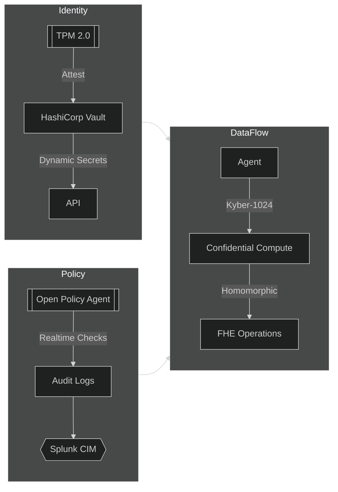

# Omnera AGENT - Enterprise Multi-Agent Framework

[](LICENSE)
[](https://slsa.dev)
[](https://securityscorecards.dev)

## Project Vision
**Omnera AGENT** redefines enterprise automation through a quantum-ready, zero-trust multi-agent framework that combines:
- **Military-Grade Security** (FIPS 140-3 validated crypto, Zero Trust Architecture)
- **Autonomous Collaboration** (DAG-based workflows with self-healing capabilities)
- **Regulatory Compliance** (GDPR/HIPAA/PCI-DSS built-in controls)

## Connect with us
[](https://twitter.com/OmneraAGENT)
[](https://twitter.com/HMichaeldouglas)
[](https://omneraai.com/)
[](https://www.linkedin.com/in/iammichaeldouglas)


## Key Enterprise Features
| Feature | Technology Stack | Compliance |
|---------|------------------|------------|
| **Agent Swarm Orchestration** | Kubernetes CRD Operators, Istio Service Mesh | SOC2 Type 2 |
| **Federated Learning** | PyTorch Federated, Homomorphic Encryption | NIST SP 800-208 |
| **Observability** | OpenTelemetry, Prometheus, Grafana Loki | ISO 27001 |
| **Post-Quantum Security** | Kyber-1024, Dilithium ML-DSA | FIPS 203 (Draft) |
| **Cost Governance** | ML-driven Resource Optimizer, FinOps API | AWS CCM |


## Core Architecture


## Zero-Trust Security


## Getting Started

### Prerequisites

- Kubernetes 1.27+ (with cert-manager)
- PostgreSQL 15+ (with pg_partman)
- HashiCorp Vault 1.15+

### Installation
```
# Clone with submodules
git clone --recurse-submodules https://github.com/Omnera-ai/core.git

# Initialize infrastructure
terraform -chdir=infrastructure/aws-eks init
terraform apply -var="cluster_name=samsara-prod"

# Deploy Omnera AI
helm install Omnera ./charts/Omnera \
  --set global.encryptionKey="$(vault read -field=key Omnera/encryption)" \
  --set prometheus.retention=1y
```

### Usage Example: Financial Risk Analysis
```
from Omnera import agents, workflows

# Create agent swarm
risk_agents = agents.Swarm(
    template="financial-risk:v4.2",
    count=50,
    config={
        "market_data_source": "bloomberg",
        "compliance_profile": "basel-iii"
    }
)

# Define ML workflow
with workflows.DAG("risk-simulation") as dag:
    data_task = dag.add_task(agents.DataCollector(regions=["NA", "EU"]))
    model_task = dag.add_task(agents.RiskModelRunner(ensemble_size=1000))
    audit_task = dag.add_task(agents.ComplianceAuditor())
    
    data_task >> model_task >> audit_task

# Execute with zero-trust verification
results = dag.execute(verification_mode="cryptographic")
```

### Deployment Options

| Environment | Configuration | SLA |
|----------|----------|----------|
| Kubernetes   | docs/deployment/k8s.md   | 99.95%   |
| AWS Outposts   | docs/deployment/aws.md   | 99.9%   |
| Hybrid Edge   | docs/deployment/edge.md   | 99.5%   |
| Docker Compose	   | docs/deployment/docker.md	   | Dev Only   |

### Contribution Guidelines

1. Security First: All PRs must pass:

- Static Application Security Testing (Semgrep)
- Software Bill of Materials (SBOM) audit

2. Compliance Checks:
```
make compliance-check RELEASE_TAG=v2.1.0
```

3. Certified Builds:

- SLSA Level 3 provenance required for production artifacts
- Signed with Cosign and Sigstore
